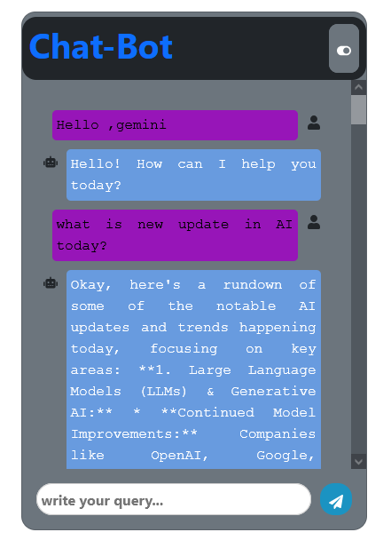
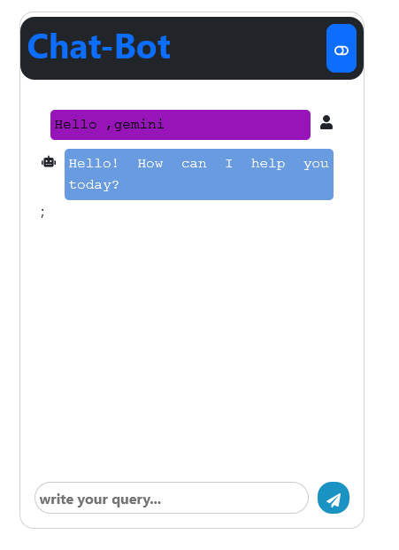

# 🤖 AI Chatbot with Gemini API

A responsive and intelligent AI chatbot interface powered by **Google Gemini API**.  
This project allows users to send queries and receive real-time generative responses in a conversational UI.

---

## 🛠️ Tech Stack Used

| Technology | Description |
|------------|-------------|
|  | Frontend UI framework |
|  | Responsive styling & layout |
|  | Scripting logic |
|  | Gemini 2.0 Generative AI model |

---

## 📁 Project Structure

project-root/
│
├── public/
│   └── index.html
│
├── src/
│   ├── components/
│   │   └── Chatbot.js       # Main chatbot logic and UI
│   ├── App.css              # Global styling
│   ├── App.js               # Main app container
│   └── Chatbot.css          # Chatbot-specific styling
│
├── package.json
└── README.md

---

## ✨ Features

- Toggle background style (transparent or dark)
- Real-time messaging with Gemini API
- Auto-scroll to latest message
- Thinking animation for bot typing
- Input field limit logic
- Responsive layout for all devices

---

## ⚙️ How to Run the Project

### 1. Clone and install dependencies

git clone /https://github.com/nimal1310/ChatBot.git
cd chatBot
npm install

const ai = new GoogleGenAI({ apiKey: 'your-api-key' });
npm start

🖼️ Preview

💡 Sample UI Flow

+------------------------------------------------------+
| ChatBot [🔘 Toggle]                                   |
|------------------------------------------------------|
| 🧠 Bot: Hello! How can I assist you today?           |
| 👤 You: Tell me a joke                              |
| 🧠 Bot: Why did the computer cross the road?        |
|         To get a byte to eat!                        |
+------------------------------------------------------+
| [ write your query... ]   [🚀]                        |
+------------------------------------------------------+

🔮 Future Enhancements
Integrate voice input (Web Speech API)

Save chat history to backend (Node.js / Firebase)

Add document-based retrieval (RAG architecture)
